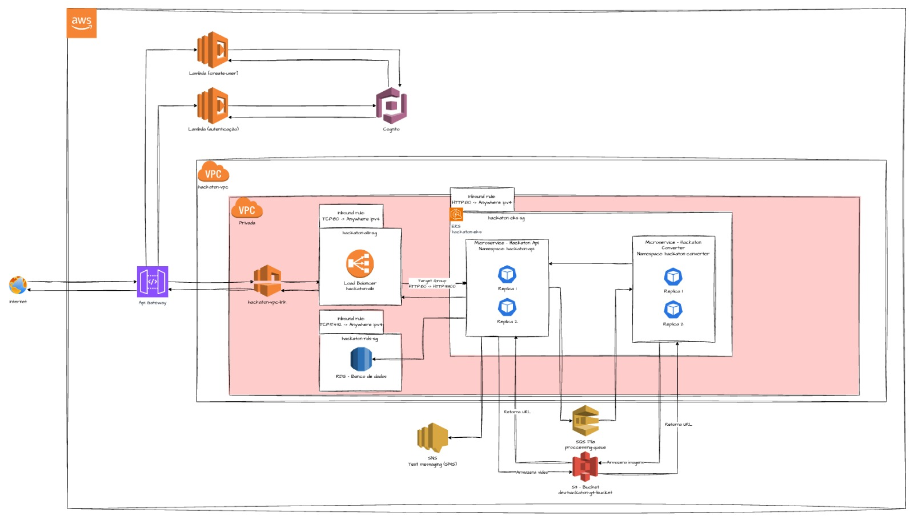

## FIAP Tech-Challenge 8SOAT - Grupo 04 - Hackaton

### Introdução

O projeto **Hackaton** é uma solução para processamento de vídeos que permite a extração de frames a cada 20 segundos, convertendo-os em imagens e disponibilizando-os em formato compactado (ZIP). A aplicação segue os princípios de arquitetura hexagonal e foi desenvolvida com foco em escalabilidade, resiliência e segurança.

A solução está dividida em três repositórios distintos, cada um com uma responsabilidade específica, seguindo princípios de arquitetura de microsserviços e infraestrutura como código.

## Arquitetura do Sistema

### Visão Geral

O sistema é composto por três componentes principais:

**hackaton-api**: API principal que gerencia o recebimento e armazenamento de vídeos, fila de processamento, disponibilização dos arquivos processados e  notificações de status ao usuário.

**hackaton-converter**: Microserviço responsável pelo processamento dos vídeos, extração de frames, geração de arquivos compactados e notificação do status de processamento à fila principal.

**hackaton-terraform**: Responsável pela criação e gerenciamento da infraestrutura na AWS, incluindo configuração de serviços de autenticação.

### Diagrama de Arquitetura

### Componentes do Sistema

#### [hackaton-api](https://github.com/8SOAT-G4-Tech-Challenge/hackaton-api)

API REST desenvolvida em Node.js com TypeScript, responsável pelas seguintes funcionalidades:

- Recebimento e validação de arquivos de vídeo
- Armazenamento dos arquivos utilizando serviços da Cloud (AWS S3)
- Disparo de solicitação de processamento de vídeo para fila de processamento
- Solicitação de envio de notificações sobre o status do processamento
- Disponibilização dos arquivos de imagens compactados para download

A API utiliza o framework Fastify para alta performance e o Prisma ORM para interação com o banco de dados PostgreSQL.

#### [hackaton-converter](https://github.com/8SOAT-G4-Tech-Challenge/hackaton-converter)

Microserviço responsável pelo processamento de vídeos, com as seguintes responsabilidades:

- Recebimento de solicitações de processamento da API principal através de fila de processamento
- Extração de frames de vídeo a cada 20 segundos
- Compactação das imagens em formato ZIP
- Armazenamento dos arquivos processados no AWS S3
- Atualização do status de processamento

#### [hackaton-terraform](https://github.com/8SOAT-G4-Tech-Challenge/hackaton-terraform)

Implementação de Infraestrutura como Código (IaC) usando Terraform para provisionar os seguintes recursos na AWS:

- VPC, subnets e grupos de segurança
- Banco de dados PostgreSQL (RDS)
- Buckets S3 para armazenamento
- EKS para disponibilização dos serviços das APIs
- Load balancers para escalonamento dos serviços
- API Gateway para configuração de rotas
- SQS para processar demandas de conversão de vídeos
- Cognito para autenticação de usuários
- Lambda para tokenização e busca de dados de usuário
- Serviço SNS para notificações

### Fluxo de Processamento e Notificação
O sistema implementa um fluxo completo de processamento de vídeos e notificação de usuários:

1. **Autenticação do Usuário**:

	- O usuário se autentica através do API Gateway
	- O API Gateway aciona uma função Lambda de tokenização
	-	A Lambda valida as credenciais com o Cognito e retorna um token JWT

2. **Envio e Processamento de Vídeo**:

	- O usuário autenticado envia um vídeo para a API principal
	- A API registra os metadados do processamento no PostgreSQL
	- O vídeo é armazenado em um bucket S3
	- A API envia uma mensagem para a fila SQS solicitando o processamento
	
3. **Conversão do Vídeo**:

	- O serviço de conversão recebe a solicitação da fila SQS
	- O serviço extrai frames do vídeo a cada 20 segundos
	- As imagens são compactadas em um arquivo ZIP
	- Os frames e o arquivo ZIP são armazenados em um bucket S3
	
4. **Atualização de Status e Notificação**:

	- O serviço de conversão envia o status de conclusão para a API principal
	- A API principal atualiza o status no banco de dados
	- A API recupera os dados do usuário no Cognito via ApiGateway / Lambda
	- A API envia uma notificação via SNS com o status atualizado (sucesso ou falha)
	- O usuário recebe um SMS informando sobre a conclusão do processamento
	- O usuário pode acessar e baixar o arquivo ZIP através da API principal

### Monitoramento e Observabilidade

A aplicação está configurada com:

- Logs estruturados usando Pino
- Métricas de performance
- Health checks para verificar a saúde do sistema

### Segurança

- Autenticação de usuários via Cognito
- Proteção contra vulnerabilidades comuns usando Helmet
- Validação de entradas usando Zod
- Configuração CORS para controle de acesso

### Tecnologias Utilizadas

- **Node 20 e Typescript**: Backend
- **Prisma**: ORM
- **Fastify**: Framework web para Node
- **Jest**: Framework de testes
- **Docker**: Containerização da aplicação e gerenciamento de serviços
- **Kubernetes**: Orquestração de containers
- **Terraform**: Gerenciamento da infraestrutura na AWS
- **AWS Cloud**: Ambiente de nuvem para execução e deploy da aplicação
	- Cognito: Serviço de autenticação de usuários
	- Lambda: Funções serverless para integração entre serviços
	- RDS Postgres: Serviço de armazenamento de dados
	- SNS: Serviço de notificação por SMS
	- S3: Armazenamento de objetos
	- SQS: Filas de mensagens
	- API Gateway: Gerenciamento de APIs
	- EKS: Serviço Kubernetes gerenciado
- **PostgreSQL**: Banco de Dados relacional

### Qualidade de código
	- Utilização do SonarCloud para inspeção contínua da qualidade de código

### Testes

TODO

### Endpoints

TODO

### Participantes

- Amanda Maschio - RM 357734
- Jackson Antunes - RM357311
- Lucas Accurcio - RM 357142
- Vanessa Freitas - RM 357999
- Winderson Santos - RM 357315
